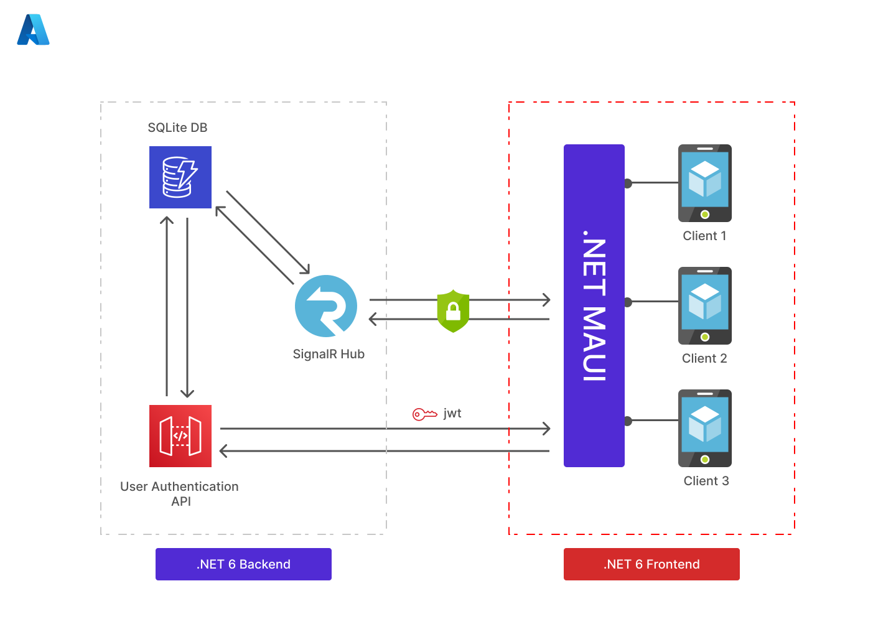
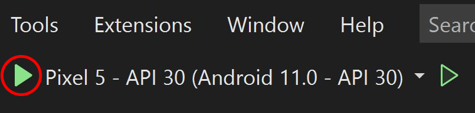

# BagIt Backend

📱 This repository houses the frontend for BagIt. BagIt a mobile application that improves the grocery shopping experience, by allowing users to easily create and share shopping lists.

## Architecture
The BagIt backend is shown below (highlighted in red). The frontend is built using .NET MAUI Blazor.
<p align="center">
    
</p>


### Built With

-   
-   

## Getting Started

### 1. Clone Project

Clone this repository:
```
git clone git@github.com:jsam07/bag-it.git
```

### 2. Open in Visual Studio Preview 2022

In order to run the MAUI application locally, you'll need to install **the latest version of** Visual Studio Preview 2022 (.NET MAUI Preview 14) with the following workloads:
  - Mobile development with .NET 
  - Universal Windows Platform development 
  - Desktop development with C++ 
  - .NET Desktop Development 
  - NET and web development (required for Blazor Desktop and the BlazorWebView control)

*Note*: this is important since .NET MAUI is still in preview, breaking changes could occur if this is not done.

Once VS Preview is configured, you can run the app in `Debug mode`, using either one of the  pre-installed `Android Emulators` or `Windows Machine` option. See below.
<p align="center">
    
</p>

Alternatively, you can download the Android App Bundle [here]().

### 3. Testing BagIt

To test the application, you can either register as a new user or user the following credentials to login:

```text
Email: ""
Password: ""
```


## Status

<p align="center">
    
</p>